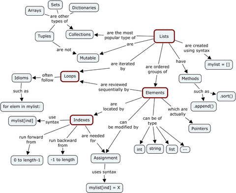

# Python 进阶
[Python 进阶](https://docs.pythontab.com/interpy/Generators/Generators/)    
[英文版: Python Tips](http://book.pythontips.com/en/latest/lambdas.html)    
## Debugging
[The Python Debugger](https://docs.python.org/3/library/pdb.html)

## Python Datastructure

