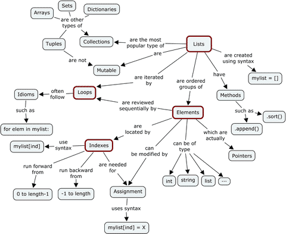

# SourceCode
SourceCode Tourial

## Html5-Css3
[html5-css3-fundamentals-development-for-absolute-beginners](https://mva.microsoft.com/en-US/training-courses/html5-css3-fundamentals-development-for-absolute-beginners-14207)      

## Http
[https://www.w3.org/Protocols/rfc2616/rfc2616.txt](https://www.w3.org/Protocols/rfc2616/rfc2616.txt)

## JavaScript　　　
[Source code for 'DOM Scripting' by Jeremy Keith and Jeffrey Sambells](https://github.com/Apress/dom-scripting-10)

## Python
[Python for Everybody_Exploring Data Using Python 3_Charles R. Severance](https://www.py4e.com/html3/01-intro)
### Python 进阶
[Python 进阶](https://docs.pythontab.com/interpy/Generators/Generators/)    
[英文版: Python Tips](http://book.pythontips.com/en/latest/lambdas.html)    
### Debugging
[The Python Debugger](https://docs.python.org/3/library/pdb.html)

### Python Datastructure

# Reading List
## Linux
[Linux Documentation Project Guides ](http://www.tldp.org/guides.html)    
[Kernel](http://www.tldp.org/LDP/tlk/tlk-toc.html)     
[Shell](http://www.learnlinux.org.za/courses/build/shell-scripting/ch01s03.html)    
[Bash](http://tldp.org/HOWTO/Bash-Prog-Intro-HOWTO.html#toc2)    
